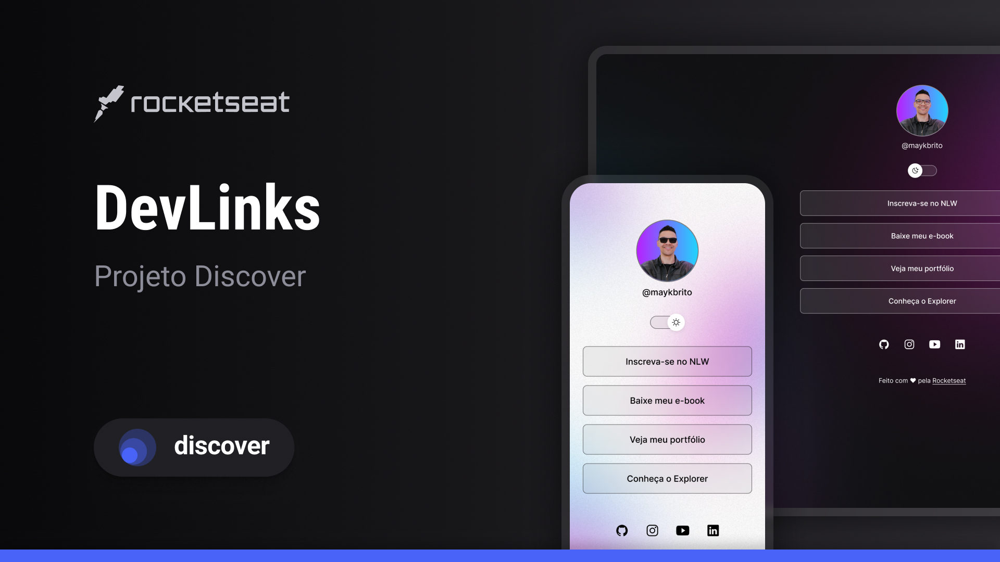

<h1 align="center"> DevLinks </h1>

An exclusive and free program promoted by Rocketseat to teach web technologies.  
<a href="https://lp.rocketseat.com.br/devlinks/inscricao?utm_source=github&utm_medium=descricao&utm_campaign=capture-devlinks&utm_term=organic&utm_content=descricao-github-mayk-brito">Study this project in video format by clicking here.</a>

<a href= "https://deka-11.github.io/dev-links/">Visit site</a>

  <a href="#-technologies">Technologies</a>&nbsp;&nbsp;&nbsp;|&nbsp;&nbsp;&nbsp;
  <a href="#-project">Project</a>&nbsp;&nbsp;&nbsp;|&nbsp;&nbsp;&nbsp;
  <a href="#-learning-experience">Learning Experience</a>&nbsp;&nbsp;&nbsp;|&nbsp;&nbsp;&nbsp;
 <a href="#-layout">Layout</a>&nbsp;&nbsp;&nbsp;|&nbsp;&nbsp;&nbsp;
  <a href="#memo-license">License</a>

  

 

  

## 🚀 Technologies

This project was developed using the following technologies:

- HTML e CSS
- JavaScript
- Git e Github
- Figma

## 💻 Project

DevLinks is a link aggregator that can be used as an online business card.

- [Access the finished project online.](https://maykbrito.github.io/devlinks)

- [Watch classes](https://lp.rocketseat.com.br/devlinks/inscricao?utm_source=github&utm_medium=descricao&utm_campaign=capture-devlinks&utm_term=organic&utm_content=descricao-github-mayk-brito)

## 📝 Learning Experience

Working on this project was an incredible learning opportunity. I improved my skills in HTML, CSS, and JavaScript, learned how to organize a project using Git and GitHub, and practiced designing layouts with Figma. This experience helped me understand how to build a functional and visually appealing online project from start to finish.

## 🔖 Layout
